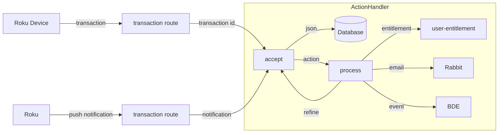

# mermaid-test
test the chrome mermaid plugin

```mermaid
flowchart LR
  RokuUI["Roku Device"]-- transaction --> troute["transaction route"]
  Roku-- push notification --> proute["transaction route"]
  troute -- transaction id -->handlerIn["accept"]
  proute -- notification -->handlerIn
  subgraph ActionHandler
    handlerIn -- json --> idb[(Database)]
    handlerIn -- action --> process[process]
    process -- refine --> handlerIn
    process -- entitlement --> user-entitlement
    process -- email --> Rabbit
    process -- event --> BDE
  end
```
